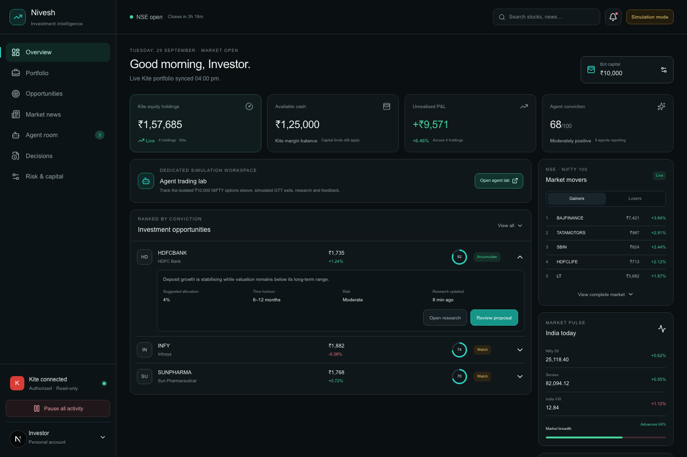
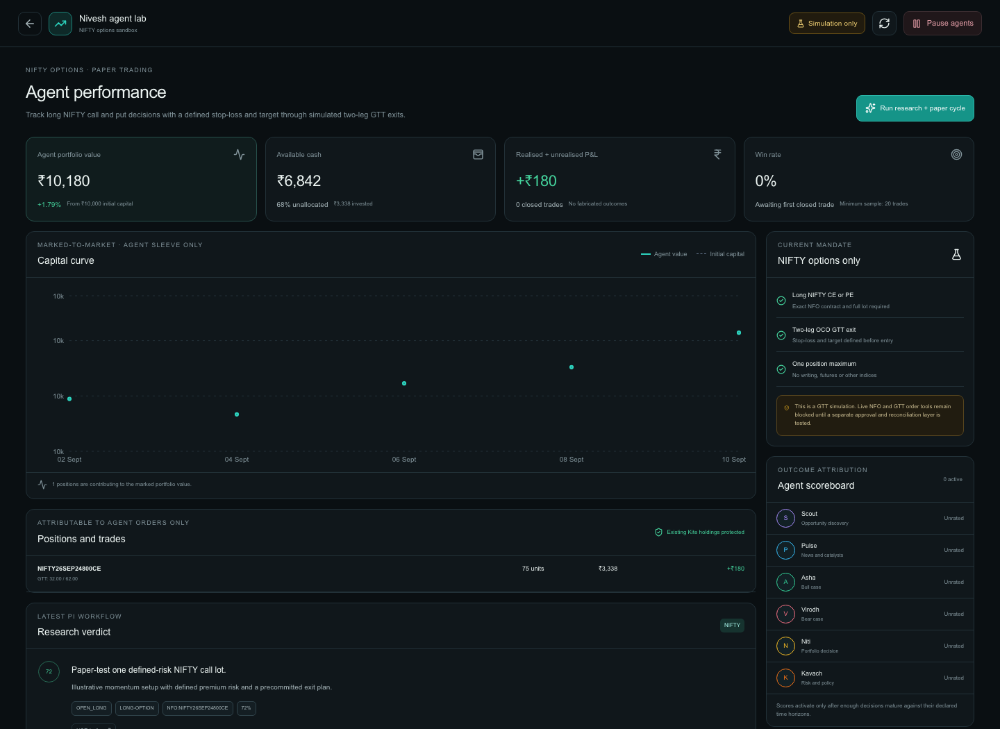
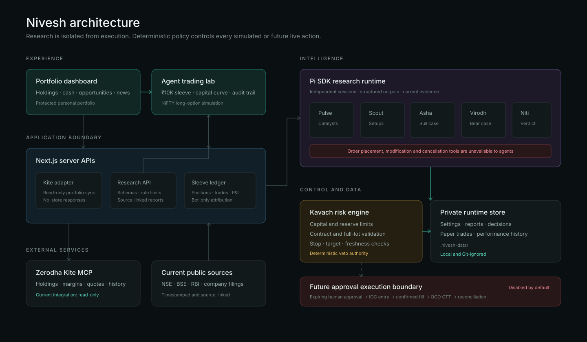

# Nivesh

<p align="center">
  <strong>A cautious, multi-agent investment workspace for Indian markets.</strong><br />
  Portfolio intelligence, current research, deterministic risk controls and an isolated NIFTY options laboratory.
</p>

<p align="center">
  
  
  
  
  <a href="LICENSE"></a>
  
</p>

> [!WARNING]
> Nivesh is experimental, local-first software. It has no multi-user authentication boundary and must not be exposed to the public internet or connected to a funded brokerage account in a public deployment. Keep live trading disabled.
>
> The screenshots below use fictional documentation fixtures. They contain no brokerage account data, real holdings, credentials or live trading signals.

## Dashboard

The main workspace combines the protected personal portfolio with capital controls, opportunities, market context and access to the isolated agent lab.



## Agent trading lab

`/agent` tracks the dedicated bot sleeve independently from existing holdings: marked-to-market capital, paper positions, research verdicts, GTT exit plans and the risk-engine audit trail.



## Architecture

Research and execution are intentionally separated. Pi agents can collect evidence and submit schema-validated reports, but they cannot call brokerage execution tools. Kavach applies deterministic policy before anything reaches the paper ledger or a future approval boundary.



## Current capabilities

- Responsive portfolio and market dashboard
- Configurable, persistent bot-capital sleeve
- Official Kite MCP authentication and read-only portfolio synchronization
- No-store responses for sensitive portfolio APIs
- On-demand research powered by independent Pi SDK sessions
- Pulse, Scout, Asha, Virodh, Niti and Kavach specialist roles
- Current web/Kite evidence with structured, source-linked reports
- Tool-call allowlists and interception around every research session
- Dedicated `/agent` performance and decision workspace
- NIFTY long-option paper engine
- Exact NFO contract and complete lot-size validation
- Simulated costs, slippage, stop-losses, targets and time exits
- Simulated two-leg OCO GTT protection using `NRML`
- Explicit executed, rejected and no-action audit records
- Existing Kite holdings protected from bot attribution and selling

## NIFTY options mandate

The isolated agent sleeve currently permits only:

- Long NIFTY calls or puts
- One open position at a time
- Exact NFO option contracts
- A complete lot that fits the configured capital and reserve
- A stop-loss and target defined before entry
- A simulated two-leg OCO GTT exit

It rejects equities, futures, BANKNIFTY, FINNIFTY, MIDCPNIFTY, short positions, option writing and incomplete lots.

## Safety model

1. Research agents never receive brokerage credentials or order tools.
2. Current quotes, contract metadata, capital and research freshness are validated outside the model.
3. A deterministic risk engine can veto every proposal.
4. The bot ledger attributes only its own positions and trades.
5. Runtime reports, account settings and portfolio snapshots stay under `.nivesh-data/`, which is Git-ignored.
6. Environment files and credentials are excluded from version control.
7. Live execution remains behind a server-side kill switch and is disabled by default.

## Run locally

### Prerequisites

- Node.js 22 or newer
- npm
- A locally configured [Pi coding agent](https://github.com/badlogic/pi-mono) and model provider for research workflows
- Optional: a Zerodha account for read-only Kite portfolio synchronization

```bash
git clone https://github.com/jitu2611/nivesh.git
cd nivesh
npm install
cp .env.example .env.local
npm run dev
```

Open [http://localhost:3000](http://localhost:3000). The dedicated trading lab is available at [http://localhost:3000/agent](http://localhost:3000/agent).

Use only a trusted local machine. The API routes assume a single-user localhost environment; request-origin checks are defense in depth, not user authentication. The `private` field in `package.json` intentionally prevents accidental npm publication and is unrelated to this repository's visibility.

## Kite authentication

Select **Connect Kite** and then **Authenticate with Kite**. Authentication happens on the official Kite/MCP page; Nivesh never asks for a Zerodha password or 2FA value.

After authorization, `/api/kite/portfolio` normalizes holdings, margins and positions without caching the response. Imported holdings are protected by default.

## Pi research runtime

A research cycle runs independent Pi sessions for:

```text
Pulse + Scout → Asha + Virodh → Niti → Kavach → paper risk engine
```

Reports are schema-validated, source-linked, rate-limited and persisted locally. Choosing no candidate or rejecting a trade is a valid outcome; the workflow never forces activity.

## Runtime data and environment

Copy `.env.example` to `.env.local`. Never commit the resulting file.

```env
BROKER_MODE=mock
NIVESH_LIVE_TRADING_ENABLED=false
```

The following remain local and excluded from Git:

```text
.env.local
.nivesh-data/settings.json
.nivesh-data/latest-research.json
.nivesh-data/bot-sleeve.json
```

## Live execution status

Approval-based live execution is **not complete or enabled**. The intended boundary is:

```text
Expiring human approval
  → IOC limit entry
  → confirmed fill quantity
  → immediate two-leg SELL GTT
  → emergency flatten if protection fails
  → broker reconciliation and audit
```

No live order should be enabled until preview signing, idempotency, partial-fill handling, GTT reconciliation and recovery tests are complete.

## Verification

```bash
npm run check
npm run build
npm audit --audit-level=moderate
```

## Contributing and security

Contributions are welcome; read [CONTRIBUTING.md](CONTRIBUTING.md) before opening a pull request. Please report vulnerabilities privately according to [SECURITY.md](SECURITY.md), not in a public issue.

Nivesh is available under the [MIT License](LICENSE).

## Disclaimer

Nivesh is experimental software, not investment advice. Options can lose their full premium rapidly. Simulated results do not guarantee live performance, and a triggered GTT limit order is not guaranteed to fill.
