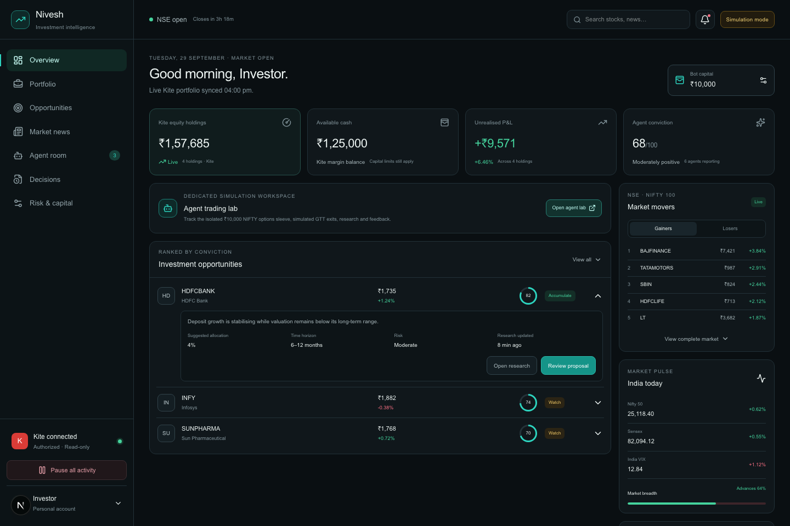
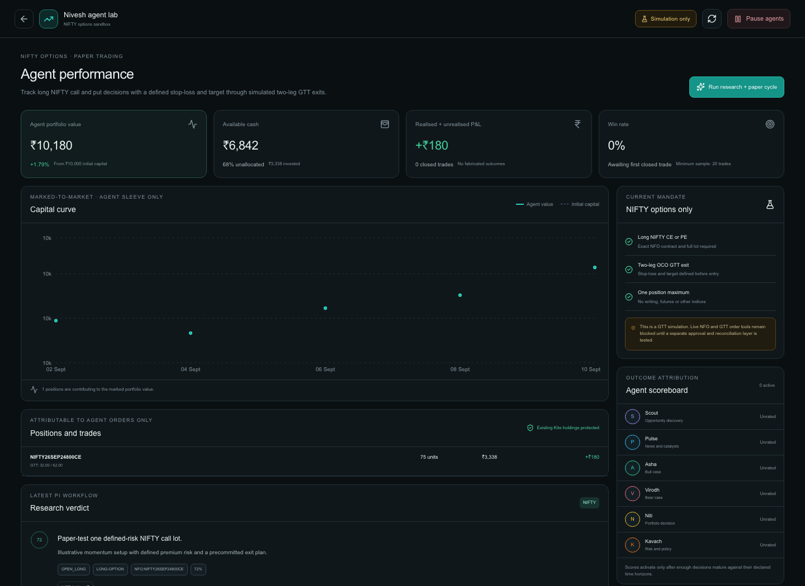
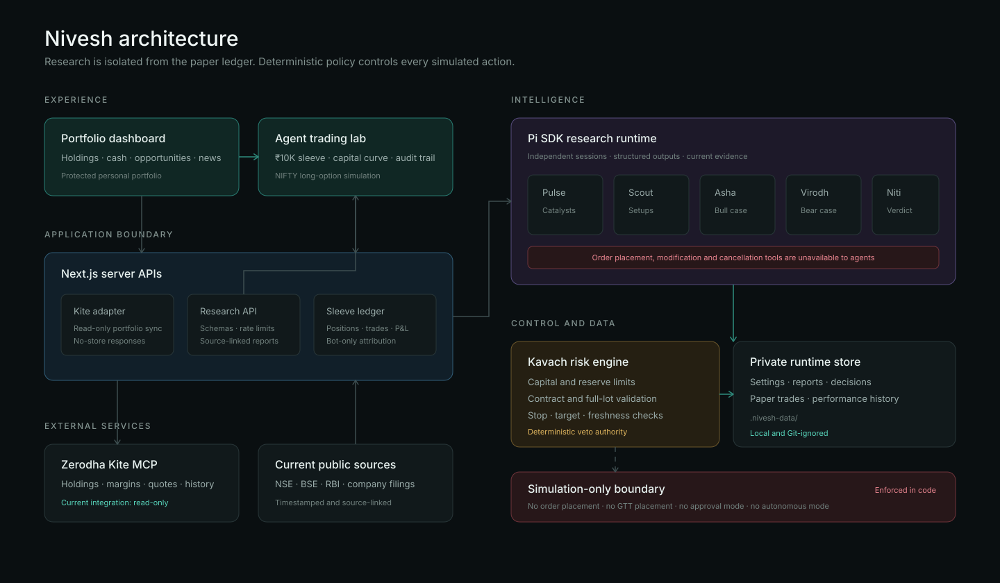

# Nivesh

<p align="center">
  <strong>A cautious, multi-agent investment workspace for Indian markets.</strong><br />
  Portfolio intelligence, current research, deterministic risk controls and an isolated NIFTY options laboratory.
</p>

<p align="center">
  
  
  
  
  <a href="LICENSE"></a>
  
</p>

> [!WARNING]
> Nivesh is experimental, local-first software. It has no multi-user authentication boundary and must not be exposed to the public internet. Brokerage integration is read-only; the application does not implement live trading.
>
> The screenshots and explicitly labelled dashboard examples use fictional fixtures. They contain no brokerage account data, real holdings, credentials or live trading signals. Actual portfolio and research data appear only after Kite synchronization or a completed research run.

## Dashboard

The main workspace combines the protected personal portfolio with capital controls, opportunities, market context and access to the isolated agent lab.



## Agent trading lab

`/agent` tracks the dedicated bot sleeve independently from existing holdings: marked-to-market capital, paper positions, research verdicts, GTT exit plans and the risk-engine audit trail.



## Architecture

Research and simulation are intentionally separated. Pi agents collect evidence and submit schema-validated reports, but they cannot call brokerage execution tools. Kavach applies deterministic policy before anything reaches the paper ledger. The application contains no live-order execution path.



## Current capabilities

- Responsive portfolio and market dashboard
- Configurable, persistent bot-capital sleeve
- Official Kite MCP authentication and read-only portfolio synchronization
- No-store responses for sensitive portfolio APIs
- On-demand research powered by independent Pi SDK sessions
- Pulse, Scout, Asha, Virodh, Niti and Kavach specialist roles
- Current web/Kite evidence with structured, source-linked reports
- Tool-call allowlists and interception around every research session
- Dedicated `/agent` performance and decision workspace
- NIFTY long-option paper engine
- Exact NFO contract and complete lot-size validation
- Simulated costs, slippage, stop-losses, targets and time exits
- Simulated two-leg OCO GTT protection using `NRML`
- Explicit executed, rejected and no-action audit records
- Persistent pause control shared by both workspaces
- Versioned, atomic runtime state with backup recovery and stale-write detection
- Loopback-only network boundary and same-origin mutation checks
- Automated policy, persistence and request-security tests
- Existing Kite holdings protected from bot attribution and selling

## NIFTY options mandate

The isolated agent sleeve currently permits only:

- Long NIFTY calls or puts
- One open position at a time
- Exact NFO option contracts
- A complete lot that fits the configured capital and reserve
- A stop-loss and target defined before entry
- A simulated two-leg OCO GTT exit

It rejects equities, futures, BANKNIFTY, FINNIFTY, MIDCPNIFTY, short positions, option writing and incomplete lots.

## Safety model

1. Research agents never receive brokerage credentials or order tools.
2. Current quotes, contract metadata, capital and research freshness are validated outside the model.
3. A deterministic risk engine can veto every proposal.
4. The bot ledger attributes only its own positions and trades.
5. Runtime reports, account settings and portfolio snapshots stay under `.nivesh-data/`, which is Git-ignored.
6. Environment files and credentials are excluded from version control.
7. Brokerage execution methods, modes and environment switches are intentionally absent.

## Run locally

### Prerequisites

- Node.js 22 or newer
- npm
- A locally configured [Pi coding agent](https://github.com/badlogic/pi-mono) and model provider for research workflows
- Optional: a Zerodha account for read-only Kite portfolio synchronization

```bash
git clone https://github.com/jitu2611/nivesh.git
cd nivesh
npm install
cp .env.example .env.local
npm run dev
```

Open [http://127.0.0.1:3000](http://127.0.0.1:3000). The dedicated trading lab is available at [http://127.0.0.1:3000/agent](http://127.0.0.1:3000/agent).

Use only a trusted local machine. Development and production scripts bind to `127.0.0.1`; Proxy rejects non-loopback hosts, and every mutation requires a matching loopback origin and explicit action header. These controls are defense in depth for a single-user local application, not multi-user authentication. The `private` field in `package.json` intentionally prevents accidental npm publication and is unrelated to this repository's visibility.

## Kite authentication

Select **Connect Kite** and then **Authenticate with Kite**. Authentication happens on the official Kite/MCP page; Nivesh never asks for a Zerodha password or 2FA value.

After authorization, `/api/kite/portfolio` normalizes holdings, margins and positions without caching the response. Imported holdings are protected by default.

## Pi research runtime

A research cycle runs independent Pi sessions for:

```text
Pulse + Scout → Asha + Virodh → Niti → Kavach → paper risk engine
```

Reports are schema-validated, source-linked, rate-limited and persisted locally. Choosing no candidate or rejecting a trade is a valid outcome; the workflow never forces activity.

## Runtime data and environment

Copy `.env.example` to `.env.local`. Never commit the resulting file.

```env
# Optional override; use an absolute private directory.
NIVESH_DATA_DIR=/absolute/path/to/private/nivesh-data
```

The following remain local and excluded from Git:

```text
.env.local
.nivesh-data/runtime.json
.nivesh-data/runtime.json.bak
.nivesh-data/latest-research.json
.nivesh-data/latest-research.json.bak
```

Legacy `settings.json` and `bot-sleeve.json` files are migrated into the versioned `runtime.json` state on first use. Writes use a same-directory temporary file, filesystem synchronization and atomic rename. A valid backup is retained for recovery; invalid persisted data causes an explicit error instead of a silent reset.

## Simulation-only boundary

Nivesh deliberately has no live order, GTT, approval or autonomous execution mode. Kite integration is read-only and is used for portfolio context, contract metadata and current prices. Paper entries and exits affect only the isolated local ledger.

The market clock currently models regular weekday NSE hours and does not maintain an exchange-holiday calendar. Missing fresh quotes never trigger simulated exits.

## Verification

```bash
npm run check        # lint + TypeScript + tests
npm run build
npm audit --audit-level=moderate
```

## Contributing and security

Contributions are welcome; read [CONTRIBUTING.md](CONTRIBUTING.md) before opening a pull request. Please report vulnerabilities privately according to [SECURITY.md](SECURITY.md), not in a public issue.

Nivesh is available under the [MIT License](LICENSE).

## Disclaimer

Nivesh is experimental software, not investment advice. Options can lose their full premium rapidly. Simulated results do not guarantee live performance, and simulated fills or exits do not represent executable market outcomes.
